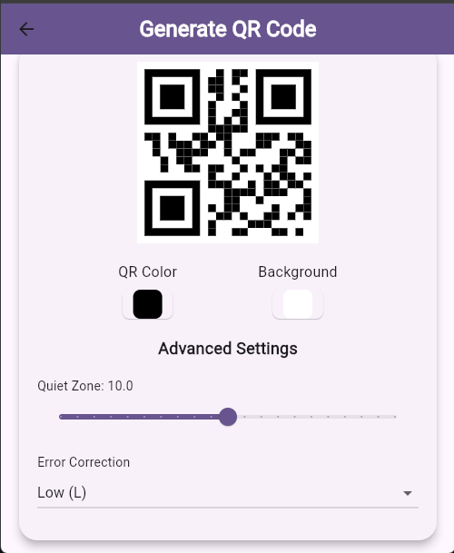
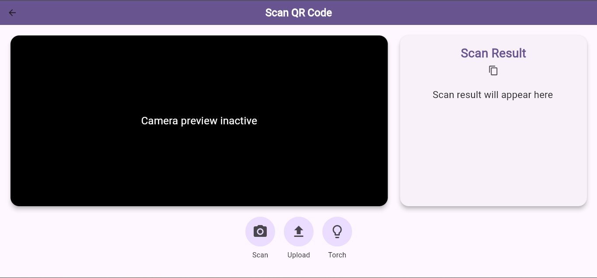

# QR4All - QR Code Generator & Scanner

QR4All is a powerful and easy-to-use **Flutter application** designed for generating and scanning QR codes across **mobile and web platforms**. With support for multiple data types, advanced customization options, and seamless sharing capabilities, QR4All is your go-to solution for all QR code needs.

## 🚀 Features

### 🔹 QR Code Generation
- **Supports Multiple Data Types:**
  - Plain Text
  - URLs (auto-adds `https://` if missing)
  - Email addresses (`mailto:` format)
  - Phone numbers (`tel:` format)
- **Customization Options:**
  - Choose QR code color
  - Set background color
  - Adjust quiet zone (padding)
  - Select error correction level (L, M, Q, H)
- **Share & Download:**
  - Share QR codes via social media and messaging apps
  - Download QR codes as high-quality PNG images

### 🔹 QR Code Scanning
- **Camera Scanning:** Scan QR codes using your device's camera
- **Image Upload:** Upload an image to scan QR codes (available on web & mobile)
- **Copy to Clipboard:** Quickly copy scanned results for easy use

## 📸 Screenshots

| Generate QR Code | Scan QR Code |
|-----------------|--------------|
|  |  |

## 🛠 Installation

### 📌 Prerequisites
- **Flutter SDK** (v3.0.0 or higher)
- **Dart SDK** (v2.17.0 or higher)

### 📌 Steps
1. **Clone the repository:**
   ```sh
   git clone https://github.com/Technolenz/qr4all.git
   cd qr4all
   ```
2. **Install dependencies:**
   ```sh
   flutter pub get
   ```
3. **Run the app:**
   ```sh
   flutter run
   ```
4. **Build for web:**
   ```sh
   flutter build web
   ```

## 🎯 Usage

### ➤ **Generate QR Code**
1. Select the data type (Text, URL, Email, Phone)
2. Enter the data in the input field
3. Customize the QR code (colors, padding, error correction)
4. Generate the QR code
5. Share or download the QR code

### ➤ **Scan QR Code**
1. Open the scanner
2. Use the camera to scan a QR code or upload an image
3. View the scanned result and copy it to the clipboard

## 📦 Dependencies
QR4All uses the following Flutter packages:
- `qr_flutter` → For generating QR codes
- `mobile_scanner` → For scanning QR codes
- `share_plus` → For sharing QR codes
- `flutter_colorpicker` → For color customization
- `http` → For web API calls (image scanning)

## 📁 Folder Structure
```sh
QR4All/
├── lib/
│   ├── generate_qr_code.dart       # QR code generation screen
│   ├── scan_qr_code.dart           # QR code scanning screen
│   ├── main.dart                   # Entry point
├── assets/                         # Static assets (images, fonts)
├── screenshots/                    # App screenshots
└── README.md                       # Project documentation
```

## 🤝 Contributing
Contributions are always welcome! Follow these steps to contribute:

1. **Fork the repository**
2. **Create a new branch:**
   ```sh
   git checkout -b feature/your-feature
   ```
3. **Commit your changes:**
   ```sh
   git commit -m "Add your feature"
   ```
4. **Push to the branch:**
   ```sh
   git push origin feature/your-feature
   ```
5. **Open a pull request** on GitHub

## 📜 License
This project is licensed under the **MIT License**. See the [LICENSE](LICENSE) file for details.

## 💙 Acknowledgments
- **Flutter Team** → For the amazing framework
- **Pub.dev** → For providing awesome packages
- **You** → For using and supporting QR4All! 😊

## 📬 Contact
For questions, feedback, or contributions, reach out via:
- **Email:** technolenz@gmail.com
- **GitHub:** [Technolenz](https://github.com/Technolenz)

Enjoy generating and scanning QR codes with **QR4All!** 🚀

